<div align="center">

<h1><code>bhavya@github</code></h1>

<h3><code>AI / ML</code> · <code>DATA SCIENCE</code> · <code>SYSTEMS</code></h3>

<p>
<b>Building intelligent systems, breaking them, understanding why, and building them again.</b>
</p>

<br>


<br><br>


<br><br>

<h3><code>bhavya@github ~ $ ./contributions.sh</code></h3>



</div>

---

## `./ABOUT`

Hey, I'm **Bhavya**.

I'm a Data Science student at **IIT Madras**, interested in the intersection of **Artificial Intelligence, Machine Learning, intelligent systems, and automation**.

I learn by building.

Not just following tutorials, not just reading documentation — actually taking an idea, turning it into something that works, watching it inevitably break, figuring out why, and then making it better.

```text
IDEA
 │
 ▼
BUILD
 │
 ▼
BREAK
 │
 ▼
DEBUG
 │
 ▼
UNDERSTAND
 │
 ▼
REBUILD
 │
 ▼
SHIP
```

Currently exploring:

```text
Artificial Intelligence
        │
        ├── Machine Learning
        ├── Large Language Models
        ├── AI Agents
        ├── Generative AI
        ├── Computer Vision
        ├── Automation
        └── Intelligent Systems
```

---

## `./CURRENTLY_EXPLORING`

```text
┌──────────────────────────────────────────────┐
│                                              │
│              CURRENT INTERESTS               │
│                                              │
│   AI / ML              ██████████████████    │
│   LLMs                 █████████████████     │
│   AI Agents            ████████████████      │
│   Generative AI        ███████████████       │
│   Automation           ██████████████        │
│   Computer Vision      ████████████          │
│                                              │
└──────────────────────────────────────────────┘
```

I'm particularly interested in systems where multiple pieces of AI, software, automation, and decision-making come together into something that can actually **do useful work**.

---

## `./TECH_STACK`

### Languages

```text
Python
C
C++
Java
JavaScript / TypeScript
```

### AI / ML

```text
Machine Learning
Large Language Models
Generative AI
Natural Language Processing
Computer Vision
AI Agents
```

### Engineering

```text
Git
GitHub
GitHub Actions
REST APIs
FastAPI
Automation
Linux
AWS
```

### AI Infrastructure

```text
Ollama
LLM APIs
Model orchestration
AI pipelines
Prompt engineering
Agentic workflows
```

---

## `./PROJECTS`

### `QUANTEX`

**AI-powered technical support ecosystem**

QUANTEX explores how AI can make technical assistance faster, more accessible, and more intelligent.

The system is designed around multimodal issue diagnosis and intelligent service coordination.

```text
                 USER
                  │
        ┌─────────┼─────────┐
        │         │         │
       TEXT      VOICE     IMAGE
        │         │         │
        └─────────┼─────────┘
                  ▼
            AI DIAGNOSIS
                  │
        ┌─────────┼─────────┐
        │         │         │
    EMERGENCY   ISSUE     CONTEXT
    DETECTION  ANALYSIS   EXTRACTION
        │         │         │
        └─────────┼─────────┘
                  ▼
       INTELLIGENT MATCHING
                  │
                  ▼
             TECHNICIAN
```

**Focus**

`AI` · `Diagnostics` · `Multimodal Systems` · `Automation` · `Recommendations` · `Multilingual AI`

---

### `AI EXPERIMENTS`

A constantly evolving collection of experiments around:

```text
AI Agents
LLM Applications
Generative AI
Machine Learning
Automation
Developer Tools
Intelligent Assistants
```

Some become projects.

Some become prototypes.

Some become spectacularly educational bugs.

The bugs are usually where the interesting part starts.

---

## `./WHAT_I_BUILD`

I like systems that sit somewhere between:

```text
                SOFTWARE
                    │
                    ▼
              ┌───────────┐
              │    AI     │
              └───────────┘
               ▲    │    ▲
               │    │    │
        DATA ───┘    │    └── AUTOMATION
                    │
                    ▼
               REAL WORLD
```

The goal isn't simply to put an LLM behind a button.

It's to build systems where intelligence actually changes **what the software can do**.

---

## `./PHILOSOPHY`

```text
BUILD
  ↓
BREAK
  ↓
DEBUG
  ↓
UNDERSTAND
  ↓
REBUILD
  ↓
SHIP
```

I don't want to just **use** AI.

I want to understand it well enough to build things with it that **shouldn't exist yet**.

---

## `./GITHUB`

This profile is intentionally built without relying on external statistics-card services.

The visual assets are generated locally using **Python, SVG, and GitHub Actions**.

```text
                     GITHUB
                       │
                       ▼
                GITHUB ACTIONS
                       │
          ┌────────────┼────────────┐
          ▼            ▼            ▼
   Contributions    Portrait     Profile Data
          │            │            │
          ▼            ▼            ▼
      Heatmap       ASCII SVG    Info Card
          │            │            │
          └────────────┼────────────┘
                       ▼
                    README
```

### Generated assets

```text
contrib-heatmap.svg
bhavya-ascii.svg
info-card.svg
```

The contribution graph and profile artwork can be regenerated automatically through GitHub Actions.

---

## `./ACTIVITY`

<h3><code>bhavya@github ~ $ git log --oneline</code></h3>

```text
build → break → learn → repeat

commit: probably another AI experiment
commit: why does this work?
commit: don't touch that file
commit: okay I touched that file
commit: fixed it
commit: ship it
```

---

## `./CONTACT`

If you're building something interesting around **AI, ML, automation, or intelligent systems**, I'd probably want to hear about it.

<br>

<div align="center">

**GitHub** · `@bhavyadevelops`

**Email** · `bhavyachokshi369@gmail.com`

<br><br>

### `BUILD → BREAK → LEARN → REPEAT`

<sub>Built with Python · SVG · GitHub Actions · an unreasonable number of experiments</sub>

</div>
